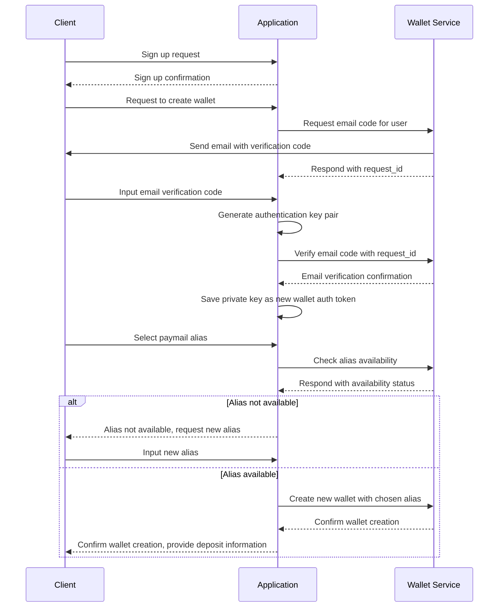

# Handcash Wallet Creation Demo

## Overview

This Next.js application demonstrates the integration of Handcash Wallet as a service, showcasing how to seamlessly attach a BSV (Bitcoin SV) wallet to your application's users through a simple email verification process. The demo utilizes a local SQLite database for data persistence.

## Features

- **Easy Wallet Creation**: Users can create a BSV wallet by verifying their email address.
- **Integrated Money Transfers**: Enables users to send and receive money within your application.
- **Next.js Framework**: Leverages the power and simplicity of Next.js for a robust frontend and API routes.
- **Local Database**: Utilizes SQLite for efficient local data storage and retrieval.

## Purpose

The primary goal of this demo is to illustrate how developers can integrate Handcash Wallet services into their applications, providing users with built-in cryptocurrency functionality without the need for complex wallet management systems.

## Technical Stack

- **Frontend**: Next.js
- **Backend**: Next.js API routes
- **Database**: SQLite
- **Wallet Service**: Handcash API

## Getting Started

1. Clone the repository:
   ```
   git clone https://github.com/HandCash/external-wallet-demo.git
   ```

2. Install dependencies:
   ```
   cd external-wallet-demo
   npm install
   ```

3. Set up environment variables:
   Create a `.env.local` file in the root directory and add your Handcash API credentials:
   ```
   HANDCASH_APP_ID=your_app_id
   HANDCASH_APP_SECRET=your_app_secret
   JWT_SECRET=secret
   NEXT_PUBLIC_APP_NAME=myApp
   ```

4. Run the development server:
   ```
   npm run dev
   ```

5. Open `http://localhost:3000` in your browser to view the application.

## Key Components

- **User Registration**: Handles user sign-up and email verification.
- **Wallet Creation**: Integrates with Handcash API to create and associate wallets with user accounts.
- **Transaction Management**: Facilitates sending and receiving BSV within the application.
- **Balance Display**: Shows real-time wallet balances for users.

## Wallet Creation Process

The following sequence diagram illustrates the wallet creation process in our application:



This diagram outlines the following process:

1. The Client signs up and requests to create a wallet.
2. The Application requests an email verification code from the Wallet Service.
3. The Client inputs the email verification code.
4. The Application verifies the code and generates an authentication key pair.
5. The private key is saved as the new wallet auth token.
6. The Client selects a paymail alias.
7. The Application checks the availability of the alias with the Wallet Service.
8. If the alias is not available, the Client is asked to input a new one.
9. If the alias is available, the Application creates a new wallet with the chosen alias.
10. Finally, the Application confirms the wallet creation to the Client and provides deposit information.

This process ensures secure wallet creation with email verification and unique alias selection.


## API Overview

The application provides a set of API endpoints to handle various functionalities related to user management, wallet creation, and transactions. These endpoints are categorized into public, authenticated, and admin-only access.

### Public Endpoints

- **Check Alias Availability**: Allows checking if a given alias is available for use.

### Authenticated Endpoints

These endpoints require user authentication:

- **Email Verification**: 
  - Request an email verification code
  - Verify the email code

- **User Information**: Retrieve the current user's information

- **Wallet Management**:
  - Create a new wallet for the user

- **Transactions**: 
  - Fetch the user's transaction history

### Admin Endpoints

These endpoints are restricted to admin users:

- **User Management**:
  - Retrieve a list of all users
  - Delete a user by email

## Database Schema

The SQLite database consists of three main tables:

`authToken` is the token to be used to create requests to the Handcash Wallet Service

### Users Table
```sql
CREATE TABLE IF NOT EXISTS users (
  id INTEGER PRIMARY KEY AUTOINCREMENT,
  email TEXT UNIQUE NOT NULL,
  passwordHash TEXT NOT NULL,
  authToken TEXT,
  walletId TEXT,
  isAdmin BOOLEAN DEFAULT 0
);
```

### User Balances Table
```sql
CREATE TABLE IF NOT EXISTS user_balances (
  userId INTEGER,
  currencyCode TEXT,
  logoUrl TEXT,
  units REAL,
  fiatCurrencyCode TEXT,
  fiatUnits REAL,
  PRIMARY KEY (userId, currencyCode),
  FOREIGN KEY (userId) REFERENCES users(id)
);
```

### Deposit Info Table
```sql
CREATE TABLE IF NOT EXISTS deposit_info (
  userId INTEGER PRIMARY KEY,
  id TEXT,
  alias TEXT,
  paymail TEXT,
  base58Address TEXT,
  FOREIGN KEY (userId) REFERENCES users(id)
);
```
## Contributing

We welcome contributions to improve this demo. Please submit issues and pull requests through the project's GitHub repository.

## License

This project is licensed under the MIT License - see the [LICENSE](LICENSE) file for details.

---

For more information on Handcash API integration, visit the [Handcash Developer Documentation](https://docs.handcash.io/).